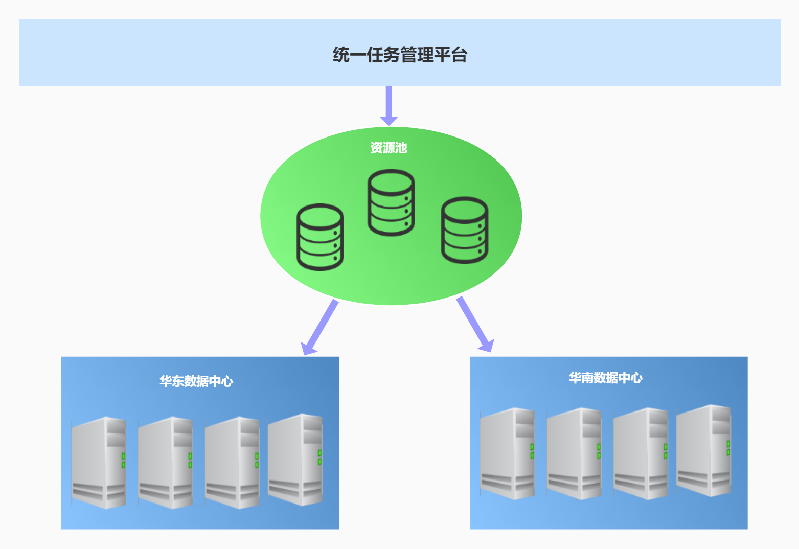
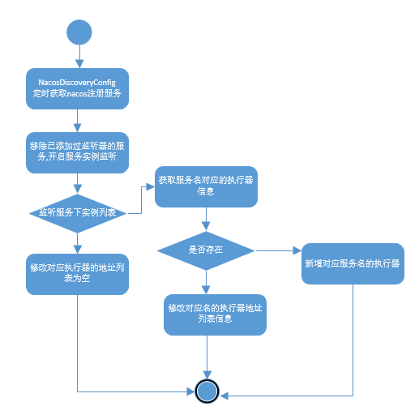
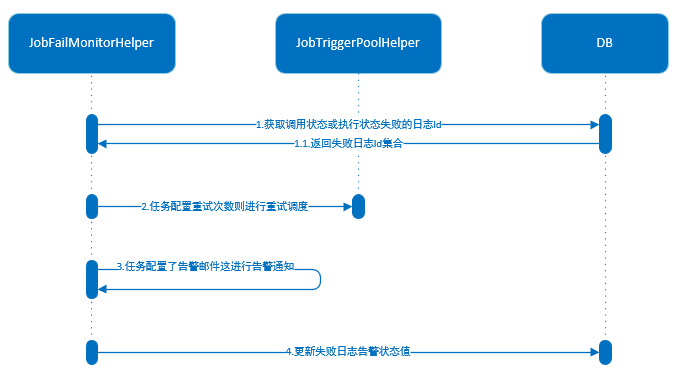
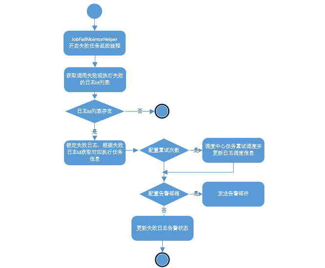
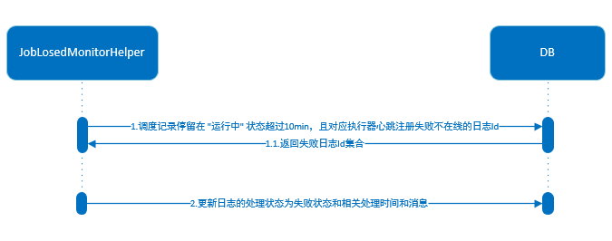
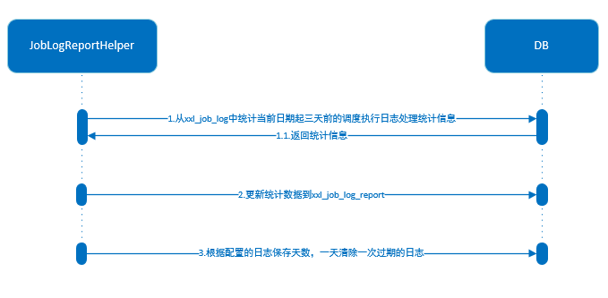
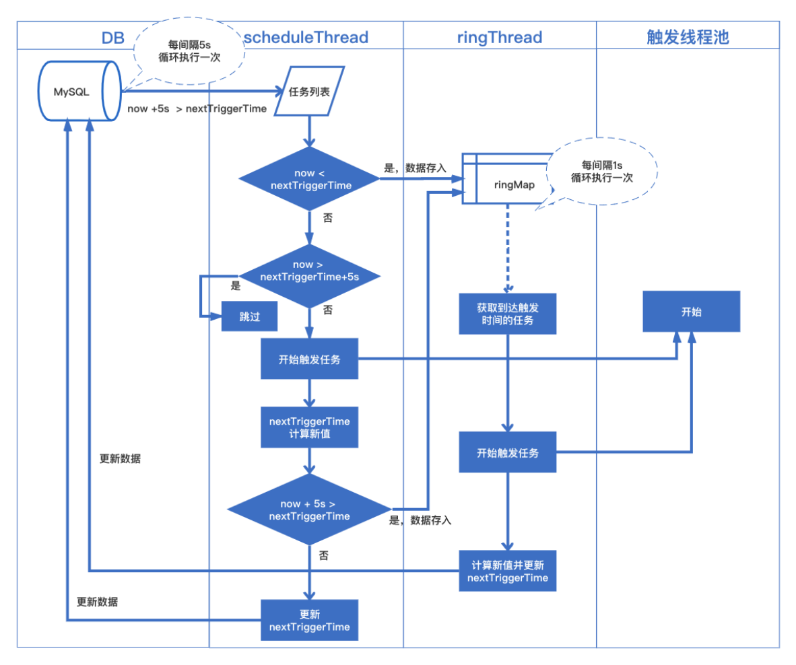

### xxl-job分布式定时任务nacos升级设计文档

#### 设计思想

​        xxl-job分布式定时任务nacos升级改造目前是基于xxl-job v2.2.0版本进行改造，xxl-job主体设计思想是将调度行为抽象形成"调度中心"公共平台，而平台本身并不承担业务逻辑，"调度中心"负责发起调度请求。将任务抽象成分散的JobHandler，交由"执行器"统一管理，"执行器"负责接收调度请求并执行对应的JobHandler中的业务逻辑。"调度"和"任务"两部分可以相互解耦，提高系统的稳定性和扩展性。

**系统组成**

* 调度模块(调度中心)：

  ​        负责管理调度信息，按照调度配置发出调度请求，自身不承担业务代码，调度系统与任务解耦，提高了系统的稳定性和扩展性，同时调度系统的性能不在受限于任务模块，支持可视化、简单动态的管理调度信息，包括任务新建，更新，删除，GLUE开发和任务报警等，这些操作都能实时生效，并且同时支持监控调度结果及执行日志，支持执行器的Failover。

* 执行模块(执行中心)：

  ​        负责接收调度中心请求并执行任务逻辑，任务模块专注与任务的执行等操作，开发和维护更加简单和高效，执行模块主要功能点：接收"调度中心"的执行请求、终止请求和日志请求等。

#### 架构设计

##### 架构图


##### nacos服务注册及服务调用流程


##### 统一任务平台多数据中心服务路由



​         运营门户操作统一任务管理平台，通过选定资源池对应的数据中心发起定时任务的远程调度，实现定时任务多数据中心统一操作控制，运营门户根据登入用户获取资源池的请求地址发送http调用。

###### 相关接口文档设计

**获取执行器列表信息**

| URL    | http://ip:port/jobgroup/list?appname=&title=&pageNum=&pageSize= |
| ------ | ------------------------------------------------------------ |
| method | GET                                                          |

*参数描述*

| 参数名 | 类型 | 是否必填 | 描述 |
| ------ | ---- | -------- | ---- |
|    appname    |     String |否          |   执行器AppName   |
|title|String|否|执行器名称|
|pageNum|int|否,默认值为1|起始页|
|pageSize|int|否，默认值为10|每页显示数|

*返回值*

```json
{
	"recordsFiltered": 2,
	"data": [{
		"id": 1,
		"appname": "xxl-job-executor-sample",
		"title": "示例执行器",
		"addressType": 0,
		"addressList": "",
		"registryList": null
	}, {
		"id": 2,
		"appname": "xxl-job-executor-sample-springCloud",
		"title": "测试执行器",
		"addressType": 0,
		"addressList": "xxl-job-executor-sample-springCloud",
		"registryList": ["xxl-job-executor-sample-springCloud"]
	}],
	"recordsTotal": 2
}
```

*返回值参数说明*

| 参数名 | 描述 |
| ------ | ---- |
|   id     |  执行器主键    |
|appname|执行器AppName|
|title|执行器名称|
|addressType|执行器地址类型：0=自动注册、1=手动录入|
|registryList|执行器地址列表|


**获取执行器对应的任务列表**

| URL    | http://ip:port/jobinfo/list?jobGroup=&triggerStatus=&jobDesc=&executorHandler=&author=&pageNum=&pageSize= |
| ------ | ------------------------------------------------------------ |
| method | GET                                                          |

*参数描述*

| 参数名   | 类型 | 是否必填 | 描述     |
| -------- | ---- | -------- | -------- |
| jobGroup | int  | 是       | 执行器ID |
|triggerStatus|int|否,默认值为-1查询所有,0-停止，1-运行|调度状态|
|jobDesc|String|否|任务描述信息|
|executorHandler|String|否|执行器任务handler|
|author|String|否|任务发布者|
|pageNum|int|否,默认值为1|起始页|
|pageSize|int|否，默认值为10|每页显示数|

*返回值*

```json
{
	"recordsFiltered": 1,
	"data": [{
		"id": 1,
		"jobGroup": 2,
		"jobCron": "0/10 * * * * ? *",
		"jobDesc": "测试任务",
		"addTime": "2018-11-03T14:21:31.000+0000",
		"updateTime": "2020-05-19T14:45:35.000+0000",
		"author": "XXL",
		"alarmEmail": "",
		"executorRouteStrategy": "FIRST",
		"executorHandler": "demoJobHandler",
		"executorParam": "",
		"executorBlockStrategy": "SERIAL_EXECUTION",
		"executorTimeout": 0,
		"executorFailRetryCount": 0,
		"glueType": "BEAN",
		"childJobId": "",
		"triggerStatus": 0
	}],
	"recordsTotal": 1
}
```

*返回值参数说明*

| 参数名 | 描述 |
| ------ | ---- |
|   jobGroup     |   执行器主键ID   |
|jobCron|任务执行CRON|
|jobDesc|任务描述|
|author|任务负责人|
|glueType|GLUE类型|
|executorHandler|执行器任务handler|
|triggerStatus|调度状态：0-停止，1-运行|
|executorBlockStrategy|String|是|阻塞处理策略|
|childJobId|String|否|子任务ID，多个逗号分隔|
|executorTimeout|int|否,默认值为0,大于0时生效|任务执行超时时间，单位秒|
|executorFailRetryCount|int|否,默认值为0,大于0时生效|失败重试次数|
|author|String|是|负责人|
|alarmEmail|String|否|报警邮件|
|executorParam|String|否|执行器，任务参数|


**新增任务**

| URL    | http://ip:port/jobinfo/add |
| ------ | -------------------------- |
| method | POST                       |

请求参数

```json
{
    "jobGroup":2,
    "jobDesc":"测试任务1",
    "executorRouteStrategy":"FIRST",
    "jobCron":"0/5 * * * * ? *",
    "glueType":"BEAN",
    "executorHandler":"springCloudDemoJobHandler",
    "executorBlockStrategy":"SERIAL_EXECUTION",
    "childJobId":"",
    "executorTimeout":0,
    "executorFailRetryCount":0,
    "author":"warrior",
    "alarmEmail":"",
    "executorParam":""
}
```

*参数描述*

| 参数名   | 类型 | 是否必填 | 描述         |
| -------- | ---- | -------- | ------------ |
| jobGroup | int  | 是       | 执行器主键ID |
|jobDesc|String|是|任务描述|
|executorRouteStrategy|String|是|执行器路由策略|
|jobCron|String|是|任务执行CRON表达式|
|glueType|String|是|GLUE类型|
|executorHandler|String|是|执行器，任务Handler名称|
|executorBlockStrategy|String|是|阻塞处理策略|
|childJobId|String|否|子任务ID，多个逗号分隔|
|executorTimeout|int|否,默认值为0,大于0时生效|任务执行超时时间，单位秒|
|executorFailRetryCount|int|否,默认值为0,大于0时生效|失败重试次数|
|author|String|是|负责人|
|alarmEmail|String|否|报警邮件|
|executorParam|String|否|执行器，任务参数|

*返回值*

```json
{
	"code": 200,
	"msg": null,
	"content": "2"
}
```


**修改更新任务**

| URL    | http://ip:port/jobinfo/update |
| ------ | ----------------------------- |
| method | POST                          |

请求参数

```json
{
    "jobGroup":2,
    "jobDesc":"测试任务1",
    "executorRouteStrategy":"FIRST",
    "jobCron":"0/5 * * * * ? *",
    "glueType":"BEAN",
    "executorHandler":"springCloudDemoJobHandler",
    "executorBlockStrategy":"SERIAL_EXECUTION",
    "childJobId":"",
    "executorTimeout":0,
    "executorFailRetryCount":0,
    "author":"warrior",
    "alarmEmail":"",
    "executorParam":"",
    "id":2
}
```

*参数描述*

| 参数名   | 类型 | 是否必填 | 描述         |
| -------- | ---- | -------- | ------------ |
| jobGroup | int  | 是       | 执行器主键ID |
|jobDesc|String|是|任务描述|
|executorRouteStrategy|String|是|执行器路由策略|
|jobCron|String|是|任务执行CRON表达式|
|glueType|String|是|GLUE类型|
|executorHandler|String|是|执行器，任务Handler名称|
|executorBlockStrategy|String|是|阻塞处理策略|
|childJobId|String|否|子任务ID，多个逗号分隔|
|executorTimeout|int|否,默认值为0,大于0时生效|任务执行超时时间，单位秒|
|executorFailRetryCount|int|否,默认值为0,大于0时生效|失败重试次数|
|author|String|是|负责人|
|alarmEmail|String|否|报警邮件|
|executorParam|String|否|执行器，任务参数|
|id|int|是|修改任务Id|

*返回值*

```json
{
	"code": 200,
	"msg": null,
	"content": null
}
```


**任务触发执行一次**

| URL    | http://ip:port/jobinfo/trigger?id=&executorParam= |
| ------ | ------------------------------------------------- |
| method | POST                                              |

*参数描述*

| 参数名 | 类型 | 是否必填 | 描述       |
| ------ | ---- | -------- | ---------- |
| id     | int  | 是       | 执行任务Id |
|executorParam|String|否|执行任务参数|

*返回值*

```json
{
	"code": 200,
	"msg": null,
	"content": null
}
```


**任务开启**

| URL    | http://ip:port/jobinfo/start?id= |
| ------ | -------------------------------- |
| method | POST                             |

*参数描述*

| 参数名 | 类型 | 是否必填 | 描述       |
| ------ | ---- | -------- | ---------- |
| id     | int  | 是       | 任务主键Id |

*返回值*

```json
{
	"code": 200,
	"msg": null,
	"content": null
}
```


**任务停止**

| URL    | http://ip:port/jobinfo/stop?id= |
| ------ | ------------------------------- |
| method | POST                            |

*参数描述*

| 参数名 | 类型 | 是否必填 | 描述       |
| ------ | ---- | -------- | ---------- |
| id     | int  | 是       | 任务主键Id |

*返回值*

```json
{
	"code": 200,
	"msg": null,
	"content": null
}
```


**任务删除**

| URL    | http://ip:port/jobinfo/remove |
| ------ | ----------------------------- |
| method | POST                          |

*参数描述*

| 参数名 | 类型 | 是否必填 | 描述       |
| ------ | ---- | -------- | ---------- |
| id     | int  | 是       | 执行任务Id |
|executorParam|String|否|执行任务参数|

*返回值*

```json
{
	"code": 200,
	"msg": null,
	"content": null
}
```


#### 调度模块

##### 调度中心轮询获取nacos服务开始服务监听

调度中心服务启动，开启nacos服务获取配置，根据配置的cron表达式定时轮询从nacos上获取注册的服务，并开启服务实例的上下线监听处理：

* 移除已经添加过监听器的服务，开启服务监听。

* 当监听服务有实例上线后，如果监听的服务名未注册执行器，则新增执行器注册，否则更新执行器的地址列表信息。
* 当监听服务实例都下线完成后，修改监听服务名的执行器的地址列表为空。


 **流程图**



##### 调度/执行失败任务监控

调度中心服务启动初始化过程中，开启调度/执行失败任务监控后台线程，定时10s轮询执行，监控线程实现功能点：

* 从`xxl_job_log`中获取调用状态或执行状态失败的日志Id，一次获取最大1000条。
* 遍历锁定告警状态`alarm_status`为0的失败日志，将告警状态设置为-1，获取失败日志对应的任务信息`xxl_job_info`。
* 如果任务配置了失败重试次数，触发线程池开启任务重试调度，更新日志信息。
* 如果任务配置了报警邮件，发送报警邮件，更新失败日志的告警状态值。




**流程图**



##### 任务调度完成等待执行器回调通知

调度中心服务启动初始化过程中，开启任务结果丢失监控后台线程，定时60s轮询执行，监控线程实现功能点：

* 调度记录停留在 "运行中" 状态超过10min，且对应执行器心跳注册失败不在线，则将本地调度主动标记失败。



##### 任务调度执行日志报表

调度中心服务启动初始化过程中，开启日志报表监控后台线程，定时1分钟轮询执行，监控线程实现功能点：

* 从`xxl_job_log`中统计当前日期起三天前的调度执行日志处理统计信息，更新到xxl_job_log_report中。
* 调度中心配置`saas.job.logretentiondays` 日志保存天数，一天清除一次过期日志。



**流程图**


##### 任务触发调度

调度中心服务启动初始化过程中，根据配置信息`xxl.job.triggerpool.fast.max`，`xxl.job.triggerpool.slow.max` 创建快触发和慢触发线程池，核心线程数都为10，最大线程数根据配置文件进行创建，默认值为200和100如果配置小于默认值，则使用默认值，任务触发调度完成功能点：

* 获取调度的执行任务及调度参数信息，保存任务日志`xxl_job_log`。
* 获取`xxl_job_lock`锁，预先获取`xxl_job_info`任务中下次执行时间在当前时间加5秒前运行中的任务且获取任务数最大为`xxl.job.triggerpool.fast.max`，`xxl.job.triggerpool.slow.max` 配置之和的20倍。
* 遍历获取的任务，如果过期超5s，本次忽略，当前时间开始计算下次触发时间；如果过期5s内，立即触发一次，当前时间开始计算下次触发时间。
* 获取环绕执行的任务，调用调度线程池根据配置的任务执行CRON进行任务调度。
* 根据调度任务Id获取任务信息及调度执行器注册的服务进行调度日志添加及feign服务调用。
* 根据feign服务调用返回结果更新执行调度日志信息。

**任务触发调度总体流程**


**JobScheduleHelper cron定时触发流程图**



#### 执行模块

##### 执行中心服务流程


##### 执行器启动注解任务注册

执行器服务启动初始化过程中，加载配置注解`@xxljob`的任务信息，开启线程异步调用调度中心任务注解接口，将新配置的任务进行添加，去除掉的任务进行删除操作。

##### 执行器接收调度中心feign调用

执行器接收到调度中心feign调度后，注册对应任务Id的任务线程`JobThread`，将触发任务放入到触发任务队列中`triggerQueue`。执行器接收到调度中心任务调度后注册的任务线程中实现的功能：

* 从触发任务队列`triggerQueue` 获取触发任务信息，进行任务执行处理。
* 任务执行处理完成后将回调任务放入到回调队列中`callBackQueue`。

##### 执行器执行完任务回调调度中心

执行器服务启动初始化过程中，开启回调线程和重试回调线程，回调线程轮询执行，重试回调线程定时30s轮询执行，其实现功能：

* 开启回调线程，从回调队列`callBackQueue`中获取回调信息，feign服务调用方式进行接口回调，处理回调结果并记录执行器回调日志。
* 开启重试回调线程，从重试调用失败的日志文件中获取重试回调信息进行重试回调操作。

##### 执行器执行任务日志文件清理

执行器服务启动初始化过程中，开启任务日志清理后台线程，定时1天轮询执行，任务日志清理后台线程实现功能：

* 如果配置文件中配置日志保留天数`xxl.job.executor.logretentiondays` 小于3天，则不执行后面内容，不创建清理线程。
* 删除超过配置日志存储天数`xxl.job.executor.logretentiondays`的日志文件。

#### 表结构设计

##### 系统用户表

**xxl_job_user**

|字段|类型|定义|
|---|---|---|
|id|int(11)|id|
|username|varchar(50)|账号|
|password|varchar(50)|密码|
|role|tinyint(4)|角色：0-普通用户、1-管理员|
|permission|varchar(255)|权限：执行器ID列表，多个逗号分割|

##### 执行器信息表
维护任务执行器信息

**xxl_job_group**

|字段|类型|定义|
|---|---|---|
|id|int(11)|id|
|app_name|varchar(64)|执行器AppName|
|title|varchar(255)|执行器名称|
|address_type|tinyint(4)|执行器地址类型：0=自动注册、1=手动录入|
|address_list|varchar(512)|执行器地址列表，多地址逗号分隔|

##### 执行器注册表
维护在线的执行器和调度中心机器地址信息

**xxl_job_registry**

|字段|类型|定义|
|---|---|---|
|id|int(11)|id|
|registry_group|varchar(50)|registry group|
|registry_key|varchar(255)|registry key|
|registry_value|varchar(255)|registry value|
|update_time|datetime|更新时间|

##### 调度扩展信息表
用于保存XXL-JOB调度任务的扩展信息，如任务分组、任务名、机器地址、执行器、执行入参和报警邮件等等

**xxl_job_info**

|字段|类型|定义|
|---|---|---|
|id|int(11)|id|
|job_group|int(11)|执行器主键ID|
|job_cron|varchar(128)|任务执行CRON|
|job_desc|varchar(255)|任务描述|
|add_time|datetime|添加时间|
|update_time|datetime|修改时间|
|author|varchar(64)|作者|
|alarm_email|varchar(255)|报警邮件|
|executor_route_strategy|varchar(50)|执行器路由策略|
|executor_handler|varchar(255)|执行器任务handler|
|executor_param|varchar(512)|执行器任务参数|
|executor_block_strategy|varchar(50)|阻塞处理策略|
|executor_timeout|int(11)|任务执行超时时间，单位秒|
|executor_fail_retry_count|int(11)|失败重试次数|
|glue_type|varchar(50)|GLUE类型|
|glue_source|mediumtext|GLUE源代码|
|glue_remark|varchar(128)|GLUE备注|
|glue_updatetime|datetime|GLUE更新时间|
|child_jobid|varchar(255)|子任务ID，多个逗号分隔|
|trigger_status|tinyint(4)|调度状态：0-停止，1-运行|
|trigger_last_time|bigint(13)|上次调度时间|
|trigger_next_time|bigint(13)|下次调度时间|

##### 任务GLUE日志
用于保存GLUE更新历史，用于支持GLUE的版本回溯功能

**xxl_job_logglue**

|字段|类型|定义|
|---|---|---|
|id|int(11)|int|
|job_id|int(11)|任务，主键ID|
|glue_type|varchar(50)|GLUE类型|
|glue_source|mediumtext|GLUE源代码|
|glue_remark|varchar(128)|'GLUE备注|
|add_time|datetime|添加时间|
|update_time|updatetime|修改时间|

##### 任务调度锁表

**xxl_job_lock**

|字段|类型|定义|
|---|---|---|
|lock_name|varchar(50)|锁名称|

##### 调度日志表
用于保存XXL-JOB任务调度的历史信息，如调度结果、执行结果、调度入参、调度机器和执行器等

**xxl_job_log**

|字段|类型|定义|
|---|---|---|
|id|bigint(20)|id|
|job_group|int(11)|执行器主键ID|
|job_id|int(11)|任务，主键ID|
|executor_address|varchar(255)|执行器地址，本次执行的地址|
|executor_handler|varchar(255)|执行器任务handler|
|executor_param|varchar(512)|执行器任务参数|
|executor_sharding_param|varchar(20)|执行器任务分片参数，格式如 1/2|
|executor_fail_retry_count|int(11)|失败重试次数|
|trigger_time|datetime|调度-时间|
|trigger_code|int(11)|调度-结果|
|trigger_msg|text|调度-日志|
|handle_time|datetime|执行-时间|
|handle_code|int(11)|执行-状态|
|handle_msg|text|执行-日志|
|alarm_status|tinyint(4)|告警状态：0-默认、1-无需告警、2-告警成功、3-告警失败|

##### 调度日志报表
用户存储XXL-JOB任务调度日志的报表，调度中心报表功能页面会用到

**xxl_job_log_report**

|字段|类型|定义|
|---|---|---|
|id|int(11)|id|
|trigger_day|datetime|调度-时间|
|running_count|int(11)|运行中-日志数量|
|suc_count|int(11)|执行成功-日志数量|
|fail_count|int(11)|执行失败-日志数量|

#### 配置详解

##### 调度模块配置

调度中心配置文件说明：

```properties
### 调度中心JDBC链接：链接地址请保持和 2.1章节 所创建的调度数据库的地址一致
spring.datasource.url=jdbc:mysql://127.0.0.1:3306/xxl_job?useUnicode=true&characterEncoding=UTF-8&autoReconnect=true&serverTimezone=Asia/Shanghai
spring.datasource.username=root
spring.datasource.password=root_pwd
spring.datasource.driver-class-name=com.mysql.jdbc.Driver
### 报警邮箱
spring.mail.host=smtp.qq.com
spring.mail.port=25
spring.mail.username=xxx@qq.com
spring.mail.password=xxx
spring.mail.properties.mail.smtp.auth=true
spring.mail.properties.mail.smtp.starttls.enable=true
spring.mail.properties.mail.smtp.starttls.required=true
spring.mail.properties.mail.smtp.socketFactory.class=javax.net.ssl.SSLSocketFactory
### 调度中心通讯TOKEN [选填]：非空时启用；
xxl.job.accessToken=
### 调度中心国际化配置 [必填]： 默认为 "zh_CN"/中文简体, 可选范围为 "zh_CN"/中文简体, "zh_TC"/中文繁体 and "en"/英文；
xxl.job.i18n=zh_CN
## 调度线程池最大线程配置【必填】
xxl.job.triggerpool.fast.max=200
xxl.job.triggerpool.slow.max=100
### 调度中心日志表数据保存天数 [必填]：过期日志自动清理；限制大于等于7时生效，否则, 如-1，关闭自动清理功能；
xxl.job.logretentiondays=30

### 允许bean覆盖
spring.main.allow-bean-definition-overriding=true

spring.application.name=xxl-job-admin

### nacos配置
spring.cloud.nacos.discovery.enabled=true
spring.cloud.nacos.discovery.server-addr=192.168.32.129:8848
spring.cloud.nacos.discovery.namespace=mj

### 获取nacos上注册的服务定时cron表达式
nacos.service.listener.cron= 0/30 * * * * ?
```

##### 执行模块配置

执行器配置文件说明：

```properties
# web port
server.port=8084
spring.application.name=xxl-job-executor

### 允许bean覆盖
spring.main.allow-bean-definition-overriding=true
#nacos注册中心配置信息
spring.cloud.nacos.discovery.enabled=true
spring.cloud.nacos.discovery.server-addr=
spring.cloud.nacos.discovery.namespace=

### 执行器通讯TOKEN [选填]：非空时启用；
xxl.job.accessToken=

# log config
logging.config=classpath:logback.xml

### 执行器运行日志文件存储磁盘路径 [选填] ：需要对该路径拥有读写权限；为空则使用默认路径；
xxl.job.executor.logpath=/data/applogs/xxl-job/jobhandler
### 执行器日志文件保存天数 [选填] ： 过期日志自动清理, 限制值大于等于3时生效; 否则, 如-1, 关闭自动清理功能；
xxl.job.executor.logretentiondays=30
```


##### 任务配置属性

**路由策略**

当执行器集群部署时，提供丰富的路由策略，包括：

* FIRST（第一个）：固定选择第一个机器；
*  LAST（最后一个）：固定选择最后一个机器；
* ROUND（轮询）：；
*  RANDOM（随机）：随机选择在线的机器；
* CONSISTENT_HASH（一致性HASH）：每个任务按照Hash算法固定选择某一台机器，且所有任务均匀散列在不同机器上;
* LEAST_FREQUENTLY_USED（最不经常使用）：使用频率最低的机器优先被选举；
* LEAST_RECENTLY_USED（最近最久未使用）：最久未使用的机器优先被选举；
* FAILOVER（故障转移）：按照顺序依次进行心跳检测，第一个心跳检测成功的机器选定为目标执行器并发起调度；
*  BUSYOVER（忙碌转移）：按照顺序依次进行空闲检测，第一个空闲检测成功的机器选定为目标执行器并发起调度；
* SHARDING_BROADCAST(分片广播)：广播触发对应集群中所有机器执行一次任务，同时系统自动传递分片参数；可根据分片参数开发分片任务；

**阻塞处理策略**

调度过于密集执行器来不及处理时的处理策略：

* 单机串行（默认）：调度请求进入单机执行器后，调度请求进入FIFO队列并以串行方式运行；
* 丢弃后续调度：调度请求进入单机执行器后，发现执行器存在运行的调度任务，本次请求将会被丢弃并标记为失败；
* 覆盖之前调度：调度请求进入单机执行器后，发现执行器存在运行的调度任务，将会终止运行中的调度任务并清空队列，然后运行本地调度任务；

**运行模式**

* BEAN模式：任务以JobHandler方式维护在执行器端；需要结合 "JobHandler" 属性匹配执行器中任务；

#### 服务部署

##### 集群(HA)部署

###### 调度中心

调度中心支持集群部署，提升系统的容灾和可用性，调度中心集群部署时需要注意点：

* DB配置保持一致。
* 集群机器时钟保持一致(单机集群忽视)。
* 建议推荐通过nginx为调度中心集群做负载均衡，分配域名，执行器回调配置，调用API服务等操作均通过该域名进行。

###### 执行器

执行器支持集群部署，提升系统的可用性，同时提升任务处理能力，执行器集群部署时需要注意点：

* 同一执行器集群内AppName  `xxl.job.executor.appname`需要保持一致，调度中心根据该配置动态发现不同集群的在线执行器列表。
